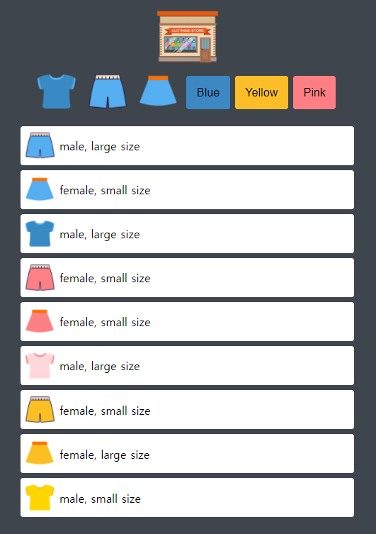
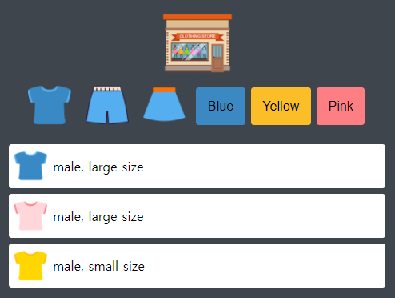
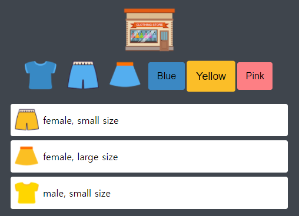
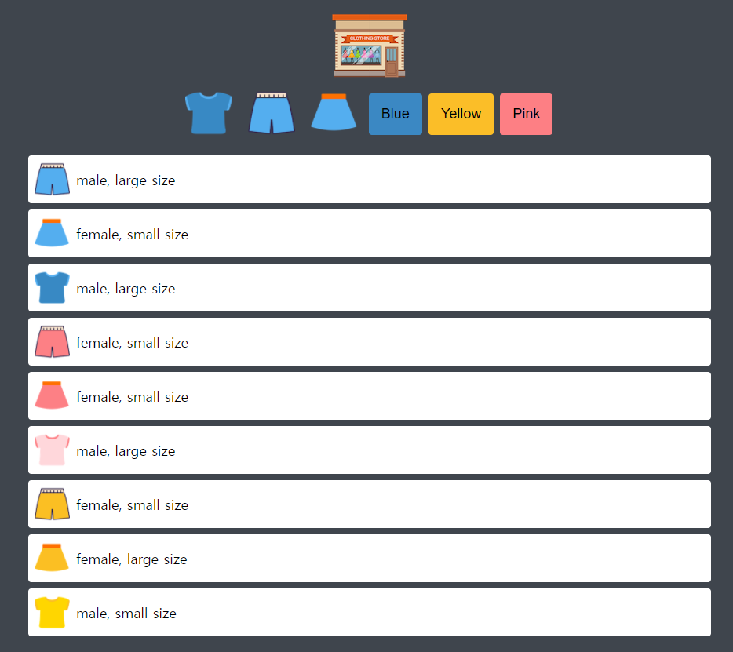
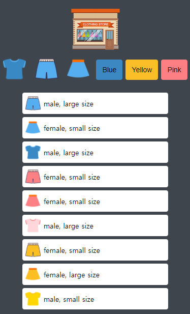

# shopping-item-lists-mini-project

## 메인화면, RESULT (all clothes)
 

 
 
 

# 📑 프로젝트의 목적

1. html 에 일일히 하드코딩 하지 않고 데이터를 받아와서 JavaScript 를 이용해 자동으로 화면에 렌더링하기
1. 특정 버튼을 클릭하면 그에 해당하는 아이템만 필터링하기  
    - (ex. 바지 버튼 클릭 => 바지들만 리스트에 출력하기)
1. 성능 최적화를 위해 html 을 계속 새롭게 렌더링하지 않고, 처음 한번 렌더링하고 css 스타일을 통해서 화면에 나타내고 사라지게끔 하기
1. 뷰포트 가로너비가 감소하면 반응성을 가지고 UI 의 크기 조정하기
 
 
 

# 📌 프로젝트에 사용한 기술들

- HTML, CSS, JavaScript
- parcel-bundler : npm 패키지들과 처리를 위해서, webpack 대신 미니 프로젝트에 맞는 간편한 parcel-bundler 를 사용
- Postcss : scss 등의 css 전처리를 위해 사용
- Babel : JavaScript 로 작성한 코드를 다양한 브라우저에서 이해할 수 있도록 변환시킬 수 있도록 사용
- Scss : 표준CSS3 를 사용하면서 불필요하게 코드가 길어지는 것을 막고 효율적으로 스타일링을 하기 위해 사용
 
 

##  💾 구현사항
 

### 1. 버튼을 클릭하면 해당하는 아이템들만 화면에 나타남

 

### 🥼 filtered by t-shirt

 

### 🟡 filtered by yellow
 

### 2. 뷰포트 가로너비에 따른 반응성 가지기
 

 

 

실제 뷰포트가 증가하고 감소함에 따라 버튼과 폰트 크기, padding 등을 조절

 
 

# ✍ 느낀점, 감상

직접 일일히 html 을 하드코딩하지 않고도 JavaScript 를 이용해서 데이터를 받아와서 정해진 css 스타일링대로 화면에 렌더링을 해봄으로써 실제로 많은 웹사이트가 이런 원리로 돌아가게 된다는 것을 알았다.🤩  
아주 작은 미니 프로젝트지만 이 작은 프로젝트를 통해서 여러모로 꽤 중요한 기술과 팁을 얻을 수 있었다. 이를 응용해서 다양한 재밌는 미니 프로젝트들을 더 만들어볼 수 있겠다는 자신감이 들었다.😎  
한편으로 버튼을 누르면 리스트를 필터링하는 기능과, 이를 매번 html 에 새롭게 렌더링하는 것이 아니라, css display 속성을 이용해 보이고 안보이고 하는데 있어서 어려움을 조금 느꼈다. 아직 조금 더 공부가 필요할 것 같다.😂